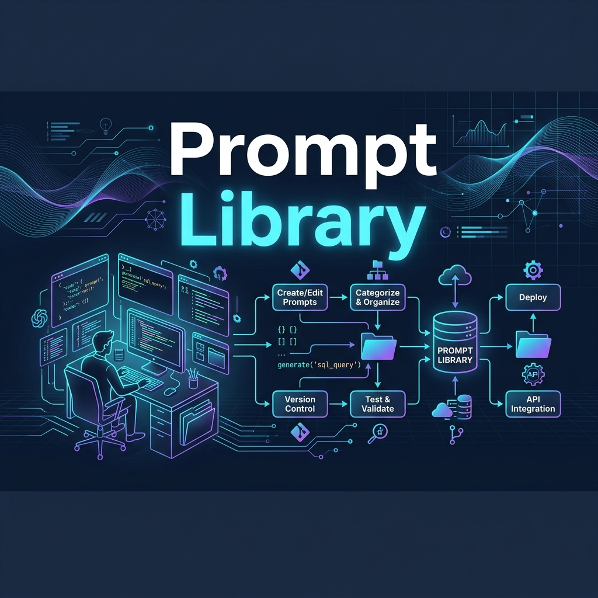

# Awesome Dev Prompts

A curated collection of production-grade AI system prompts, templates, and engineering workflows for developers, system architects, DevOps engineers, and UI/UX designers.

---

## Banner & Logo

---

## Categories

| Category | Description | Key Topics |
|---|---|---|
| [Frontend](frontend/) | Modern web UI development prompts | React, Next.js, Vue, Angular, Tailwind, Components, Accessibility |
| [Backend](backend/) | Server-side architecture & APIs | Node.js, Express, NestJS, FastAPI, Laravel, API Design |
| [Mobile](mobile/) | Cross-platform & native mobile app dev | React Native, Expo, Flutter, Kotlin, Swift, Optimization |
| [AI & GenAI](ai/) | LLMs, RAG, Agents, & Model Protocols | LLMs, RAG, Autonomous Agents, LangChain, OpenAI, Gemini, MCP |
| [Architecture](architecture/) | System design patterns & principles | Microservices, Monolith, Clean Arch, Event-Driven, Scalability |
| [Databases](databases/) | Schema design, SQL & NoSQL optimization | PostgreSQL, MySQL, MongoDB, Supabase, Redis, Query Tuning |
| [DevOps](devops/) | Containerization, CI/CD, & Infra | Docker, Kubernetes, CI/CD, GitHub Actions, Nginx, Monitoring |
| [Deployment](deployment/) | Release, Security & Cloud Hosting | Production Checklist, Vercel, AWS, Azure, Cloudflare |
| [Testing](testing/) | Unit, Integration, & End-to-End | Playwright, Cypress, Vitest, Jest, Coverage Strategies |
| [Security](security/) | App Sec, Auth & Vulnerability Scans | Auth, JWT, OWASP Top 10, Penetration Testing, API Security |
| [Performance](performance/) | Full-stack performance optimization | Frontend metrics, Backend bottlenecks, Caching, DB Tuning |
| [System Design](system-design/) | Scalable system design & interviews | Distributed Systems, Rate Limiters, Queues, Load Balancing |
| [Documentation](documentation/) | Technical docs & specs | API Docs, READMEs, PRDs, SRS, Changelogs, Specs |
| [GitHub](github/) | Repository workflows & automation | Issues, PRs, Release Notes, Templates, Action Workflows |
| [UI / UX](ui-ux/) | Interface design & visual systems | Figma, Design Systems, Dashboards, Mobile UI, Landing Pages |
| [Prompt Engineering](prompt-engineering/) | Meta-prompts & LLM techniques | Chain-of-Thought, Reasoning, Agent Prompts, Reusable Prompts |
| [Templates](templates/) | Code modification & review checklists | Bug Fixes, Features, Refactoring, Code Review, Migrations |

---

## How to Use These Prompts
1. Navigate to the relevant category folder (e.g., `frontend/react.md` or `ai/rag.md`).
2. Copy the **System Prompt** into your LLM tool (ChatGPT, Claude, Gemini, Cursor, Antigravity).
3. Fill out the variable placeholders in the **User Prompt Template**.
4. Generate production-ready code, specs, or diagnostic reports!

---

## Contributing
Contributions are warmly welcomed! Please read our [CONTRIBUTING.md](CONTRIBUTING.md) guide before submitting a Pull Request.

---

## License
This repository is licensed under the [MIT License](LICENSE).
